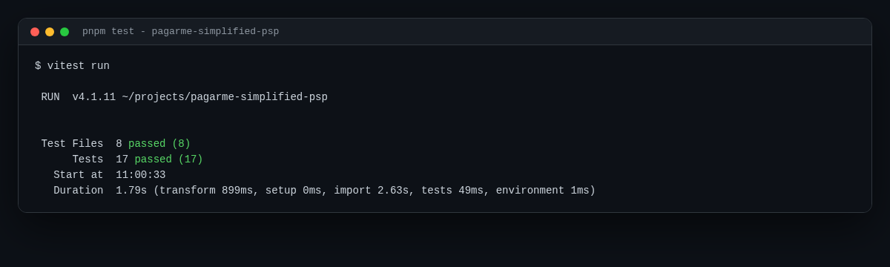
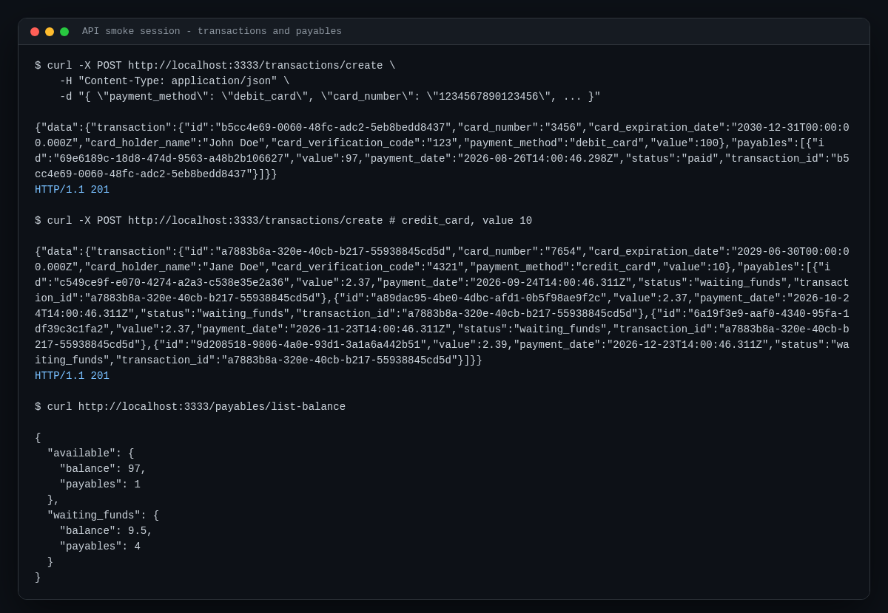

# pagarme-simplified-psp



A simplified Pagar.me style payment service. It processes debit and credit card transactions, schedules payables according to card rules and exposes balances, built as a portfolio study of clean architecture on top of Express.

## Objective

Recreate the core of a payment service provider (PSP) following the classic Pagar.me backend challenge: create transactions, generate receivables (payables) with method specific fees and settlement dates, and query consolidated balances. The project focuses on domain modeling and layer separation rather than real money movement.

## Stack

| Concern | Choice |
| --- | --- |
| Runtime | Node 22 LTS |
| Language | TypeScript 6 in strict mode |
| HTTP | Express 5 |
| Validation | Zod 4 |
| Dates | date-fns 4 behind a DateProvider interface |
| Tests | Vitest 4 |
| Dev server | tsx watch |
| Production build | tsup (esm bundle) |
| Package manager | pnpm |

## Domain rules

- Debit cards settle at D+1 with a single payable in `paid` status and a 3 percent fee.
- Credit cards create four payables at D+30, D+60, D+90 and D+120 in `waiting_funds` status with a 5 percent fee.
- The transaction always stores the gross amount; fees are discounted on the payable amounts.
- Credit installments split cents evenly and the last installment absorbs the rounding remainder.
- Card numbers only persist the last four digits.

## Concepts demonstrated

- Clean architecture layers: domain, application use cases, infra adapters.
- DDD building blocks: entities, value objects (`CardNumber`), mappers, domain errors.
- Functional error handling with an `Either` type on operations that can fail.
- Composition root with a single dependency container shared by all routes.
- Repository interfaces ready to swap in memory implementations for a real database.
- Pluggable providers (`DateProvider`) so time can be faked in tests.
- Request validation at the edge with Zod schemas per route.
- Consistent response envelope: `{ data }` for success, `{ error }` for failures.
- Global async error handling on Express 5 with a centralized error middleware.

## API smoke session



| Method | Route | Description |
| --- | --- | --- |
| POST | `/transactions/create` | Creates a transaction plus its payables |
| GET | `/transactions/list` | Lists every transaction |
| GET | `/payables/list-balance` | Available and waiting funds balance |

### Example request

```bash
curl -X POST http://localhost:3333/transactions/create \
  -H "Content-Type: application/json" \
  -d '{
    "payment_method": "debit_card",
    "card_number": "1234567890123456",
    "card_holder_name": "John Doe",
    "card_expiration_date": "12/30",
    "card_verification_code": "123",
    "value": 100
  }'
```

```json
{
  "data": {
    "transaction": {
      "id": "b5cc4e69-0060-48fc-adc2-5eb8bedd8437",
      "card_number": "3456",
      "card_holder_name": "John Doe",
      "payment_method": "debit_card",
      "value": 100
    },
    "payables": [
      { "value": 97, "payment_date": "2026-08-26T14:00:46.298Z", "status": "paid" }
    ]
  }
}
```

Validation failures return HTTP 400 with field level details:

```json
{
  "error": {
    "message": "Validation failed",
    "name": "ValidationError",
    "details": [
      { "field": "payment_method", "message": "payment_method must be 'debit_card' or 'credit_card'" }
    ]
  }
}
```

## Quickstart

Requires Node 22 (an `.nvmrc` is included) and pnpm.

```bash
nvm use
pnpm install
pnpm dev
```

The server starts on `http://localhost:3333` (override with the `PORT` env var, see `.env.example`).

## Scripts

| Script | What it does |
| --- | --- |
| `pnpm dev` | Watch mode dev server |
| `pnpm build` | Production bundle into `dist/` |
| `pnpm start` | Runs the production bundle |
| `pnpm test` | Runs the whole suite once |
| `pnpm test:cov` | Suite with coverage report |
| `pnpm typecheck` | Strict TypeScript check, zero errors expected |
| `pnpm lint` | ESLint flat config check |

## Project structure

```text
src/
├── core/                        # kernel: Either, Entity, Controller contract, route adapter
├── modules/
│   ├── transaction/
│   │   ├── application/         # create and list transaction use cases + controllers
│   │   ├── domain/              # Transaction entity, CardNumber VO, repository interface
│   │   └── infra/               # express routes, factories, zod schema, in memory repository
│   └── payable/
│       ├── application/         # create payable and list balance use cases + controllers
│       ├── domain/              # Payable entity, fee policy, repository interface, mapper
│       └── infra/               # express routes, factories, in memory repository
└── shared/
    ├── container.ts             # composition root shared by all routes
    └── providers/date/          # DateProvider interface + date-fns implementation
```

## Roadmap

- [ ] Swap in memory repositories for Prisma + SQLite behind the same interfaces
- [ ] HTTP integration tests with Supertest against the Express app
- [ ] CI workflow running typecheck, lint and tests on push
- [ ] Authentication so balances are scoped per merchant
- [ ] Pagination on list endpoints

## License

Released under the [MIT License](LICENSE).

---

Built by [Tiago Gonçalves de Castro](https://github.com/tiagogcastro) · [LinkedIn](https://www.linkedin.com/in/tiagogcastro)
